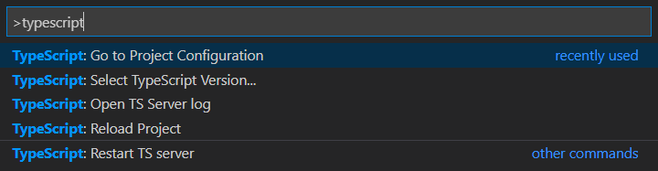

<!-- paginate: true -->
<!-- headingDivider: 3 -->
<!-- footer: '[Abraham Schilling](https://github.com/n4bb12), 10.08.2020' -->

<!-- Theme -->
<style>
section {
  font-size: 1.25rem;
  line-height: 1.5;
}
h1,
h2,
h3,
h4,
h5,
h6 {
  color: #224466;
  margin-bottom: 1.5rem;
}
h1,
h2,
h3,
h4,
h5,
h6,
p {
  width: 100%;
  text-align: center;
}
h1 img,
h2 img,
h3 img,
h4 img,
h5 img,
h6 img,
pre img {
  display: inline;
}
p img {
  display: table;
}
blockquote,
ul,
ol,
table
pre {
  width: auto;
  margin: 0 auto 1rem;
}
p {
  width: auto;
  margin: 0 auto 0.5rem;
}
pre + pre {
  margin-top: -0.75rem;
}
footer {
  font-size: 0.75rem;
}
footer a {
  text-decoration: underline;
  color: inherit;
}
pre {
  width: 90%;
  margin: 0 auto 1rem;
  border: 0;
  background: #0a0d14;
  color: white;
  font-size: 1rem;
}
.hljs-keyword,
.hljs-selector-tag,
.hljs-type {
  color: #e40f1f;
}
.hljs-number,
.hljs-string,
.hljs-built_in {
  color: #b30c7f;
}
.hljs-attr,
.hljs-selector-attr,
.hljs-selector-class,
.hljs-selector-id,
.hljs-selector-pseudo,
.hljs-title {
  color: #ee7600;
}
</style>

<!-- TypeScript Theme -->
<!-- https://www.typescriptlang.org/branding -->
<style>
:root {
  --ts-black: #000000;
  --ts-blue1: #3178C6;
  --ts-blue2: #358EF1;
  --ts-blue3: #235A97;
  --ts-blue4: #00273F;
  --ts-yellow: #F1DD35;
  --ts-olive: #C6BF31;
  --ts-smoke: #FAF9F8;
  --ts-purple: #560072;
  --ts-red: #790000;
  --ts-green: #007055;
  --ts-teal: #004F70;
}
h1,
h2,
h3,
h4,
h5,
h6 {
  color: var(--ts-blue1);
}
a {
  color: var(--ts-blue3);
  text-decoration: underline;
}
pre {
  border-radius: 0;
  border: 1px solid var(--ts-blue4);
  background: var(--ts-smoke);
  color: var(--ts-black);
  width: 60%;
}
</style>

<!-- TypeScript Code Theme -->
<!-- https://www.typescriptlang.org/branding -->
<style>
/*  */
code {
  background: #F1F1FE;
  color: #000000;
}
.hljs-attr     { color: #A31515; }
.hljs-built_in { color: #000000; }
.hljs-comment  { color: #008000; }
.hljs-keyword  { color: #0000FF; }
.hljs-number   { color: #09835A; }
.hljs-string   { color: #A31515; }
.hljs-title    { color: #000000; }
</style>

<!-- Slides -->
# Advanced TypeScript

<style scoped>
section { 
  background: linear-gradient(-45deg, var(--ts-blue4), var(--ts-blue1));
}
h1 { 
  color: white;
}
</style>

<!-- _paginate: false -->
<!-- _header: "" -->
<!-- _footer: "" -->

## Overview

- TSConfig
- Language Features
- Utilities
- Authoring Types

## TSConfig

<!-- header: "" -->

### Source Files

<!-- header: "TSConfig" -->

`include`

- Relative to the directory containing the tsconfig.json
- Glob support: `*`, `?`, `**`
- Default extensions: `.ts`, `.tsx`, `.d.ts`, (`.js`, `.jsx` with `allowJs`)

### Source Files

`files`

- unnecessary subset of `include`

### Source Files

`exclude`

- Same syntax as `includes`
- Only overrides `includes`

### Source Files: Troubleshooting

```sh
tsc --listFiles
```

[TSConfig: File Inclusion](https://www.typescriptlang.org/tsconfig#Project_Files_0)

### Multiple Targets

`extends`

- re-use common base configuration
- extend a shareable config

```json
{
  "extends": "../tsconfig.json"
}
```

```json
{
  "extends": "@tsconfig/node12/tsconfig.json"
}
```

[Example: bases](https://github.com/n4bb12/ts-project/tree/master/bases)
[tsconfig/bases](https://github.com/tsconfig/bases#available-tsconfigs)

### Multiple Targets

`references`

- Composite projects
- Solution-Style projects

### Composite Projects

- Greatly improve build times
- Enforce logical separation
- Enable `composite` in the source project
- Enable `declarationMap` in the source project
- Use the `--build` flag

[Example: composite](https://github.com/n4bb12/ts-project/tree/master/composite)
[TS Handbook: Project References](https://www.typescriptlang.org/docs/handbook/project-references.html)

### Solution-Style Projects

- Solves the limitations of just "tsconfig.json"

```json
{
  "include": [],
  "references": [
    { "path": "./tsconfig.shared.json" },
    { "path": "./tsconfig.frontend.json" },
    { "path": "./tsconfig.backend.json" },
  ],
}
```

[Example: solution](https://github.com/n4bb12/ts-project/tree/master/solution)
[TS Handbook: Project References](https://www.typescriptlang.org/docs/handbook/project-references.html)

### Multiple Targets: Troubleshooting

```sh
tsc --showConfig --project tsconfig.json
```



### Module Types

`module`

- `None` - cjs input, cjs output --> legacy Node.js, target <=ES5
- `CommonJS` - esm input, cjs output --> Node.js <=12
- `ES2015` - esm input, esm output 
  - Node.js with `*.mjs` or `{ "type": "module" }` or [esm](https://github.com/standard-things/esm) loader
  - Transpilers and bundlers in combination with `noEmit`
- `ES2020` - adds async `import()` and `import.meta`
- `ESNext` - adds stage 3 proposals, moving pointer

[Node.js: ESM](https://nodejs.org/api/esm.html)
[TSConfig: module](https://www.typescriptlang.org/tsconfig#module)

### Module Types

`allowSyntheticDefaultImports` (type-checking)
`esModuleInterop` (code-emit)

```ts
module.exports = somethingCjs // export = somethingCjs
module.exports.propCjs = propCjs // export = { propCjs }

export default somethingDefaultESM
export const somethingNamedESM
```

```ts
import * as somethingCjs from "somethingCjs"
import somethingCjs from "somethingCjs"
import { propCjs } from "somethingCjs"

import somethingDefaultESM from "somethingDefaultESM"
import { default as somethingDefaultESM } from "somethingDefaultESM"
import { somethingNamedESM } from "somethingNamedESM"
```

[Example: module](https://github.com/n4bb12/ts-project/tree/master/module)
[TSConfig: esModuleInterop](https://www.typescriptlang.org/tsconfig/#esModuleInterop)

### Importing Assets

`resolveJsonModule`

- `*.json` is not a default source extension
- Augment `webpack` loaders, e.g. `{raw,url,file,react-svg}-loader` with typings:

```ts
declare module "*.png" {
  const content: string
  export default content
}
```

```ts
declare module "*.svg" {
  const content: FC<SVGAttributes<SVGElement>>
  export default content
}
```

[Webpack: TypeScript Guide](https://webpack.js.org/guides/typescript/#importing-other-assets)

### Type Aquisition

- `lib` - ambient library types
- `types` - ambient types
- `typeRoots` - module roots
- `typeAcquisition` - selective module includes or excludes

```json
{
  "compilerOptions": {
    "lib": ["DOM", "DOM.iterable", "ES2019"],
    "types": ["node", "jest"],
    "typeRoots": ["node_modules/@types", "./typings"],
    "typeAcquisition": { "exclude": ["jquery"] }
  }
}
```

### Library Types

- `ES2019` includes `ES2019.array`, `ES2019.object`, etc. and `ES2018`

```sh
tsc --listFiles
```

### Resolving Issues

- `skipLibCheck` - Ignore errors in libraries, only type-check sources
- `noImplicitAny` - Declare missing modules manually

```ts
declare module "untyped"

declare module "other" {
  const content: { foo: "string" }
  export default content
}
```

### Path Mapping

`baseUrl`, `paths`

[TS Handbook: Path mapping](https://www.typescriptlang.org/docs/handbook/module-resolution.html#path-mapping)
[tsconfig-paths](https://www.npmjs.com/package/tsconfig-paths)
[ts-jest: Path mapping](https://kulshekhar.github.io/ts-jest/user/config/#paths-mapping)

### Target ES Version

`target`

- Transpiles language features, e.g. `?.`
- Doesn't polyfill built-ins, e.g. `Promise.allSettled`

[node.green](https://node.green/)
[tsconfig/bases](https://github.com/tsconfig/bases#available-tsconfigs)

### Import Helpers

`importHelpers`

- use `tslib` to emit helper-code only once
- equivalent of `@babel/plugin-transform-runtime`

[tslib](https://node.green/)
[Example: tslib](https://github.com/n4bb12/ts-project/tree/master/tslib)

### React

- `jsx` - What to do with JSX
- `jsxFactory` - `React.createElement`
- `jsxFragmentFactory` - `React.Fragment` (v4)

[Example: react](https://github.com/n4bb12/ts-project/tree/master/react)


### Type-Only Imports

`importsNotUsedAsValues`

- `remove` - auto-detect and remove type-only imports (default)
- `preserve` - deliberately preserve potential side-effects
- `error` - force explicit `import type`

[Example: import-type](https://github.com/n4bb12/ts-project/tree/master/import-type)

### Output Structure

`rootDir`, `outDir`

- `rootDir` is inferred to the longest common path
- Make it explicit to avoid changing output structures
- `outDir` defaults to the source file
- Change it to separate source and output

[TSConfig: rootDir](https://www.typescriptlang.org/tsconfig#rootDir)
[TSConfig: outDir](https://www.typescriptlang.org/tsconfig#outDir)

### Maps

- `sourceMap` - generate `.js.map` files
- `inlineSourceMap`, `inlineSources` - better performance (development)
- `declaration` - generate `.d.ts` files
- `declarationMap` - generate `.d.ts.map` files (jump to source instead of typing)

### TypeScript with Babel

`isolatedModules`
`noEmit` or `emitDeclarationOnly`

- Disable cross-file analysis
- Ensure type-stripping-only results in valid code
- `"jsx": "preserve"`
- `module`, `target`, `outDir`, `importHelpers`, etc. become irrelevant

[Babel Caveats](https://babeljs.io/docs/en/babel-plugin-transform-typescript#caveats)
[Babel Mapping for TSConfig](https://babeljs.io/docs/en/babel-plugin-transform-typescript#typescript-compiler-options)
[TSConfig: isolatedModules](https://www.typescriptlang.org/tsconfig#isolatedModules)

### TSC vs Babel - Differences

- `const enum`- TSC
- `export = `, `import =` - TSC
- `namespace` - TSC, `declare namespace` - Babel
- contextual namespaces
- `module`, `target` - TSC
- `"jsx": "react"` - TSC, `"jsx": "preserve"` - Babel

[Example: babel](https://github.com/n4bb12/ts-project/tree/master/babel)
[microsoft/TypeScript-Babel-Starter](https://github.com/microsoft/TypeScript-Babel-Starter)

### Debugging and Performance

```sh
tsc --showConfig
tsc --listFiles
tsc --listEmittedFiles
tsc --extendedDiagnostics
tsc --traceResolution
```

[TS Wiki: Performance](https://github.com/microsoft/TypeScript/wiki/Performance)

### Comprehensive Options

[TSConfig](https://www.typescriptlang.org/tsconfig)
[CLI Flags](https://www.typescriptlang.org/docs/handbook/compiler-options.html)

# 🖐 Thank You!

<!-- _header: "" -->
<!-- _paginate: false -->

<style scoped>
h1 { 
  color: white; 
  text-shadow: 0 0 2rem black;
}
section { 
  padding: 0;
  justify-content: center;
}
</style>


