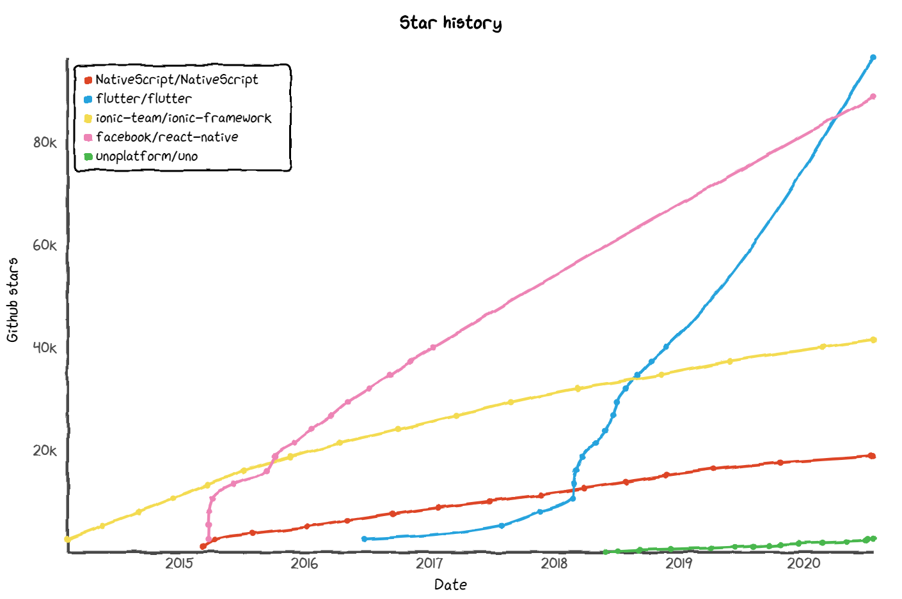

<!-- marp: true -->
<!-- paginate: true -->
<!-- headingDivider: 3 -->
<!-- footer: '[Abraham Schilling](https://github.com/n4bb12), 17.07.2020' -->

<!-- N4BB12 Theme -->

<!-- Presentation Styles -->

# Mobile — Native & Web Strategies

## Mobile OS Share

[Source](https://en.wikipedia.org/wiki/Mobile_operating_system#Market_share) | [Animation](https://www.youtube.com/watch?v=MMyMB4zm9so) | [Breakdown & History](https://en.wikipedia.org/wiki/Mobile_operating_system)

## Revenue & Download Share

[Source](https://sensortower.com/blog/app-revenue-and-downloads-2019)

## Platforms

## Outline

Launch Considerations
Platform Features
Development Frameworks

# Launch Considerations

## User Retention

25% of users abandon apps after one use.

[Source](https://clevertap.com/blog/guide-to-user-retention/)

## Store Marketing Costs

[Source](https://themanifest.com/mobile-apps/why-marketing-critical-mobile-app-success)

## Store Fees

- $25 one-time on Android / $99 yearly on iOS
- 30% commission on app purchases
- 30% commission on first-year subscriptions, then 15%
- Physical goods cannot be sold with in-app payments
- Digital goods must be sold with in-app payments

[Netflix](https://help.netflix.com/en/node/25097) | [Spotify](https://support.spotify.com/us/account_payment_help/payment_help/spotify-through-the-app-store/)

## Store Updates

- Submission reviews
- Possibility of rejection

--> *Delay*

[Review Guidelines 4.2](https://developer.apple.com/app-store/review/guidelines/#minimum-functionality)

## Web Fees

- [PayPal](https://www.paypal.com/de/webapps/mpp/paypal-fees): 2.49% - 1.49% + €0.35
- [Google Checkout](https://payments.google.com/seller/fees.html): 2.90% - 1.90% + $0.30
- [Amazon Payments](https://pay.amazon.de/help/SKX7JCY3G3SP73U): 1.90% - 1.20% + €0.35
- [Stripe](https://stripe.com/en-de/pricing): 1.40% + €0.25
- [Klarna](https://stripe.com/en-de/pricing): 1.35% + €0.20
- Domain and web server costs

## Web Launch & Update

- Deploy whenever you like
- Deploy as frequently as you like

## Finding the App

- Featured store apps
- Top lists
- Store page
- [Android Deep Links](https://developer.android.com/training/app-links/deep-linking) | [iOS Universal Links](https://developer.apple.com/ios/universal-links/)
- [Google Play Pass](https://play.google.com/about/play-pass/) | [Apple Arcade](https://www.apple.com/de/apple-arcade/)

--> *Get users through the web*

## Finding Web Content

- Search indexing
- Search result previews
- Shopping search
- Image search
- Various sources of links
- Linking is easy and specific

## Store Onboarding

High-friction install-first philosophy:
(Find) - Download (Wait) - Install (Wait) - Open - Use

- [Android Instant Apps](https://www.youtube.com/watch?v=oispNrpGnIY) | [iOS App Clips](https://www.youtube.com/watch?v=IqP_iojZXxQ)

--> *Requires a website*

## Web Onboarding

Use-first philosophy:
(Find) - Open - Use - (Install)

## Market Data, Analytics & News

- https://www.businessofapps.com/data/app-statistics/
- https://www.businessofapps.com/data/app-revenues/
- https://www.appannie.com/en/insights/

# Platform Features

----

Web applications built on standard browser APIs 
that feel and can be used like native mobile apps.

## Features (OS Integration, Sensors)

https://whatwebcando.today

- Live feature test
- Detailed descriptions
- Code examples and API references
- Desktop & Mobile stats

## Case Studies

Facebook Lite, Twitter Lite, Aliexpress, Forbes, Pinterest, 
Uber, Tinder, Flipboard, Starbucks, Alibaba, Lancome

- [Google PWA Case Studies](https://developers.google.com/web/showcase)
- [PWA Stats Case Studies](https://www.pwastats.com/)
- [Mobile Web vs. Native Apps or Why You Want Both](https://www.lukew.com/ff/entry.asp?1954)

# Frameworks

## Native & Cross-Platform Frameworks

 

 
 
 
 
 

<!-- Nativescript !== WebAssembly -->

## Charactersitics

| SDK                                                                                                       | Maintainer | Language                                                                                                  | Library               | Primary IDE                            | Output Code                         | Output UI                                   | OS                  |                                                                                        |
| --------------------------------------------------------------------------------------------------------- | ---------- | --------------------------------------------------------------------------------------------------------- | --------------------- | -------------------------------------- | ----------------------------------- | ------------------------------------------- | ------------------- | -------------------------------------------------------------------------------------- |
|  Android                    | Google     | Kotlin                                                                                                    | Android SDK           | Android Studio                         | Native                              | native                                      | Android             |                                                                                        |
|  iOS                            | Apple      | Swift                                                                                                     | iOS SDK               | Xcode                                  | Native                              | native                                      | iOS                 |                                                                                        |
|  Flutter                                       | Google     | Dart                                                                                                      | Flutter SDK           | Android Studio, IntelliJ IDEA, VS Code | Native                              | platform-specific [Skia](https://skia.org/) | (Web), Android, iOS | [Architecture](https://flutter.dev/docs/resources/technical-overview)                  |
|  React Native                                             | Facebook   | TypeScript                                                                                                | React                 | Any                                    | JavaScript, Native Widgets (Bridge) | native                                      | (Web), Android, iOS | [Architecture](https://reactnative.dev/docs/intro-react-native-components)             |
|  Ionic                                        | Drifty     | TypeScript                                                                                                | Angular, React, (Vue) | Any                                    | JavaScript, Native APIs (WebView)   | platform-specific, (shared)                 | Web, Android, iOS   | [Architecture](https://ionicframework.com/docs/core-concepts/fundamentals)             |
|  NativeScript               | nStudio    | TypeScript                                                                                                | Angular, Vue          | Any                                    | JavaScript, Native APIs (Bridge)    | native                                      | Web, Android, iOS   | [Architecture](https://docs.nativescript.org/angular/core-concepts/technical-overview) |
|  Xamarin                       | Microsoft  | C#, [XAML](https://docs.microsoft.com/en-us/xamarin/xamarin-forms/xaml/xaml-basics/essential-xaml-syntax) | .NET                  | Visual Studio                          | Native / IL                         | platform-specific [Skia](https://skia.org/) | Android, iOS        | [Architecture](https://docs.microsoft.com/en-us/xamarin/get-started/what-is-xamarin)   |
|  Uno | nventive   | C#, XAML                                                                                                  | .NET, Uno.UI          | Visual Studio                          | Native / IL / WebAssembly           | platform-specific, (shared)                 | Web, Android, iOS   | [Architecture](https://platform.uno/how-it-works/)                                     |

## Framework Popularity

[Source](https://star-history.t9t.io/#flutter/flutter&facebook/react-native&ionic-team/ionic-framework&NativeScript/NativeScript&unoplatform/uno)

## Language & Platform Popularity

[Languages](https://insights.stackoverflow.com/survey/2020#technology-programming-scripting-and-markup-languages-professional-developers)
[Platforms](https://insights.stackoverflow.com/survey/2020#technology-platforms)

## AMP

[Docs](https://amp.dev)
[How it works](https://amp.dev/about/how-amp-works)
[Cache](https://amp.dev/documentation/guides-and-tutorials/learn/amp-caches-and-cors/how_amp_pages_are_cached)
[Playground](https://playground.amp.dev)

# ✋ Thank you!

