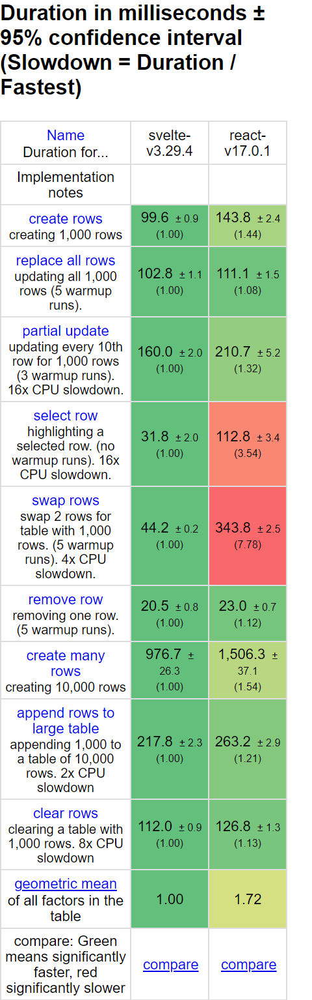
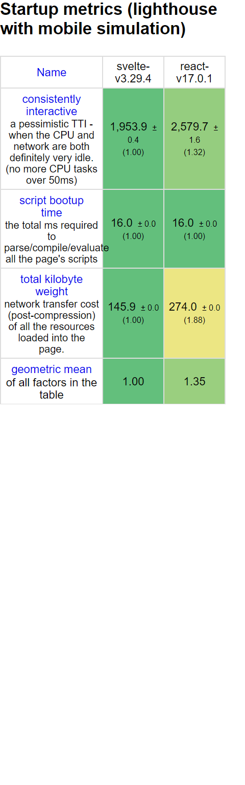
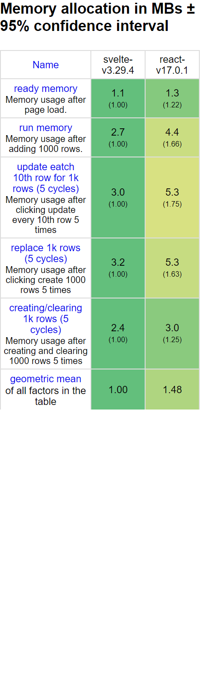

<!-- paginate: true -->
<!-- headingDivider: 1 -->
<!-- footer: '[Abraham Schilling](https://github.com/n4bb12), 29.04.2021' -->

<!-- Base Theme -->
<style>
  section {
    font-size: 1.25rem;
    line-height: 1.5;
    justify-content: start;
  }
  h1,
  h2,
  h3,
  h4,
  h5,
  h6 {
    color: #224466;
    margin-bottom: 1.5rem;
  }
  h1,
  h2,
  h3,
  h4,
  h5,
  h6,
  p {
    width: 100%;
    text-align: center;
  }
  h1 img,
  h2 img,
  h3 img,
  h4 img,
  h5 img,
  h6 img,
  pre img {
    display: inline;
  }
  p img {
    display: table;
  }
  blockquote,
  ul,
  ol,
  table,
  pre {
    width: auto;
    margin: 0 auto 1rem;
  }
  p {
    width: auto;
    margin: 0 auto 0.5rem;
  }
  pre + pre {
    margin-top: -0.75rem;
  }
  footer {
    font-size: 0.75rem;
  }
  footer a {
    text-decoration: underline;
    color: inherit;
  }
  pre {
    width: 90%;
    margin: 0 auto 1rem;
    border: 0;
    background: #0a0d14;
    color: white;
    font-size: 1rem;
  }
  .hljs-keyword,
  .hljs-selector-tag,
  .hljs-type {
    color: #e40f1f;
  }
  .hljs-number,
  .hljs-string,
  .hljs-built_in {
    color: #b30c7f;
  }
  .hljs-attr,
  .hljs-selector-attr,
  .hljs-selector-class,
  .hljs-selector-id,
  .hljs-selector-pseudo,
  .hljs-title {
    color: #ee7600;
  }

  /* Split Slides */
  /* Inspired by https://www.gitmemory.com/issue/marp-team/marpit/137/524175560 */
  section.split {
    overflow: visible;
    display: grid;
    grid-template-columns: 1fr 1fr;
    grid-template-rows: auto 1fr;
    grid-template-areas:
      "slideheading slideheading"
      "leftpanel rightpanel";
  }
  section.split h1 {
    grid-column: span 2;
  }
  section.split .left {
    grid-area: leftpanel;
  }
  section.split .right {
    grid-area: rightpanel;
  }
</style>

<style>
  @import url("https://fonts.googleapis.com/css2?family=Overpass:wght@300;400;700&display=swap");

  :root {
    --back: #ffffff;
    --back-light: #f6fafd;
    --back-api: #eff8ff;
    --prime: #ff3e00;
    --second: #676778;
    --flash: #40b3ff;
    --text: #444;
    --font: "Overpass", sans-serif;
    --font-mono: "Fira Mono", monospace;

    color: var(--text);
    font-family: var(--font);
    font-weight: 300;
  }
  h1,
  h2 {
    text-transform: uppercase;
    font-weight: 400;
    color: var(--second);
  }
  a {
    color: var(--prime);
    text-decoration: none;
    border-bottom: 1px solid currentColor;
  }
  a:hover,
  a:active {
    color: var(--flash);
    text-decoration: none;
  }
  footer a {
    text-decoration: none;
  }
  .svelte {
    color: var(--prime);
  }
  .react {
    color: #61dbfb;
    color: #224466;
  }
</style>

#


https://svelte.dev

<style scoped>
  section {
    padding-top: 15%;
  }
</style>

# Approach

- 🧹 No runtime library
  https://svelte.dev/blog/frameworks-without-the-framework
- 🐎 No DOM diffing
  https://svelte.dev/blog/virtual-dom-is-pure-overhead
- 💀 Death to boilerplate
  https://svelte.dev/blog/write-less-code
- 🔨 Let tools do the work
  https://svelte.dev/blog/svelte-3-rethinking-reactivity

# JS Size

<!-- _class: split -->

<div class="left">
<h2 class="react">React</h2>

create-react-app
**43.8 kB**

todo mvc
**226 kB**

next-realworld
**108 kB**

</div>

<div class="right">
<h2 class="svelte">Svelte</h2>

svelte template
**2.0 kB**

todo mvc
**7.4 kB**

sveltekit-realworld
**18.4 kB**

</div>

# Benchmark





https://krausest.github.io/js-framework-benchmark/2021/table_chrome_90.0.4430.72.html

# Create App

```
npx degit sveltejs/template svelte-app
cd svelte-app
node scripts/setupTypeScript.js
yarn
yarn dev
```

<style scoped>
  pre {
    max-width: 50%;
  }
</style>

# How Do I ... in Svelte

https://svelte.dev/docs

- Component Format
  - html
    - {expressions}
    - disabled={disabled}, {disabled}
    - slot, slot name="name", slot="name", $$slots, slot {item}, slot let:item
    - class, class:name={value}
    - style={``}
    - @html
    - on:eventname|modifiers={handler}
    - bind:property={variable}, bind:duration, bind:group
  - script
    - props --> export let
    - $$props, $$restProps
    - context=module
    - createEventDispatcher
  - style
- Hooks https://github.com/joshnuss/react-hooks-in-svelte
  - useState --> not needed
  - useEffect --> onMount, onDestroy, beforeUpdate, afterUpdate, tick, or not needed
  - useMemo --> $:
  - useRef --> bind:this
  - useCallback --> not needed
  - useContext --> setContext, getContext, hasContext
- global state --> svelte/store, writeable, readable, derived, get, $value
- Structural directives
  - #if/elseif/else
  - #each, index, key
- Only in Svelte
  - #await, then, catch
  - #key
  - @debug
  - use:action
  - animations
    - svelte/transition
      - transition:fn|local={params}
      - in:fn|local={params}
      - out:fn|local={params}
      - animate:name={params}
    - svelte/motion
      - tweened
      - spring
    - svelte/easing
  - svelte:selv
  - svelte:component
  - svelte:window
  - svelte:body
  - svelte:head
  - svelte:options
  - svelte:fragment

# VSCode Plugins

- [Svelte for VS Code](https://marketplace.visualstudio.com/items?itemName=svelte.svelte-vscode) — syntax highlighting / formatting / intellisense 💬
- [Svelte 3 Snippets](https://marketplace.visualstudio.com/items?itemName=fivethree.vscode-svelte-snippets) — `s-` prefixed snippets 🚀
- [Svelte Dark](https://marketplace.visualstudio.com/items?itemName=NickScialli.svelte-dark) — dark theme inspired by Svelte 💅
- ❌ You DON'T need [Svelte Intellisense](https://marketplace.visualstudio.com/items?itemName=ardenivanov.svelte-intellisense), it is unmaintained, outdated, and its features are included in the main extension
- ❌ You DON'T need [svelte-format](https://marketplace.visualstudio.com/items?itemName=melihaltintas.svelte-format), formatting is included in the main extension and uses Prettier via [prettier-plugin-svelte](https://github.com/sveltejs/prettier-plugin-svelte#prettierrc-example)

# Frameworks


https://kit.svelte.dev

<br>
<br>


https://svelte-native.technology

<style scoped>
  img {
    margin: 0 auto;
  }
</style>

# Rethinking Reactivity

<iframe
  width="640"
  height="360"
  src="https://www.youtube-nocookie.com/embed/AdNJ3fydeao"
  title="YouTube video player"
  frameborder="0"
  allow="accelerometer; autoplay; clipboard-write; encrypted-media; gyroscope; picture-in-picture"
  allowfullscreen
></iframe>

<style scoped>
  iframe {
    margin: 0 auto;
  }
</style>

#


## Thanks

<style scoped>
  section {
    padding-top: 15%;
  }
  h2 {
    font-size: 2rem;
    color: #444;
  }
</style>
