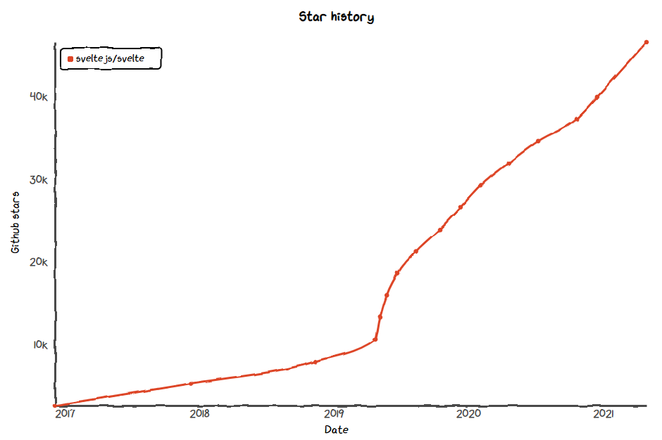

<!-- paginate: true -->
<!-- headingDivider: 1 -->
<!-- footer: '[Abraham Schilling](https://github.com/n4bb12), 30.04.2021' -->

<!-- Base Theme -->
<style>
  section {
    font-size: 1.25rem;
    line-height: 1.5;
    padding: 20%;
    padding-top: 10%;
  }
  h1,
  h2,
  h3,
  h4,
  h5,
  h6 {
    color: #224466;
    margin-bottom: 1.5rem;
  }
  h1,
  h2,
  h3,
  h4,
  h5,
  h6,
  p {
    width: 100%;
    text-align: center;
  }
  h1 img,
  h2 img,
  h3 img,
  h4 img,
  h5 img,
  h6 img,
  pre img {
    display: inline;
  }
  blockquote,
  ul,
  ol,
  table,
  pre {
    width: auto;
    margin: 0 auto 1rem;
  }
  p {
    width: auto;
    margin: 0 auto 0.5rem;
  }
  pre + pre {
    margin-top: -0.75rem;
  }
  footer {
    font-size: 0.75rem;
  }
  footer a {
    text-decoration: underline;
    color: inherit;
  }
  pre {
    width: 90%;
    margin: 0 auto 1rem;
    border: 0;
    background: #0a0d14;
    color: white;
    font-size: 1rem;
  }
  .hljs-keyword,
  .hljs-selector-tag,
  .hljs-type {
    color: #e40f1f;
  }
  .hljs-number,
  .hljs-string,
  .hljs-built_in {
    color: #b30c7f;
  }
  .hljs-attr,
  .hljs-selector-attr,
  .hljs-selector-class,
  .hljs-selector-id,
  .hljs-selector-pseudo,
  .hljs-title {
    color: #ee7600;
  }

  /* Split Slides */
  /* Inspired by https://www.gitmemory.com/issue/marp-team/marpit/137/524175560 */
  section.split {
    overflow: visible;
    display: grid;
    grid-template-columns: 1fr 1fr;
    grid-template-rows: auto 1fr;
    grid-template-areas:
      "slideheading slideheading"
      "leftpanel rightpanel";
  }
  section.split h1 {
    grid-column: span 2;
  }
  section.split .left {
    grid-area: leftpanel;
  }
  section.split .right {
    grid-area: rightpanel;
  }
</style>

<style>
  @import url("https://fonts.googleapis.com/css2?family=Overpass:wght@300;400;700&display=swap");

  :root {
    --back: #ffffff;
    --back-light: #f6fafd;
    --back-api: #eff8ff;
    --prime: #ff3e00;
    --second: #676778;
    --flash: #40b3ff;
    --text: #444;
    --font: "Overpass", sans-serif;
    --font-mono: "Fira Mono", monospace;

    color: var(--text);
    font-family: var(--font);
    font-weight: 300;
  }
  h1,
  h2 {
    text-transform: uppercase;
    font-weight: 400;
    color: var(--second);
  }
  a {
    color: var(--prime);
    text-decoration: none;
    border-bottom: 1px solid currentColor;
  }
  a:hover,
  a:active {
    color: var(--flash);
    text-decoration: none;
  }
  footer a {
    text-decoration: none;
  }
  .svelte {
    color: var(--prime);
  }
  .react {
    color: #61dbfb;
    color: #224466;
  }
</style>

#


https://svelte.dev

# Developer Interest



- Growing community
- Great documentation
- High developer satisfaction
- SvelteKit

[https://2020.stateofjs.com/technologies/front-end-frameworks](https://2020.stateofjs.com/en-US/technologies/front-end-frameworks/#front_end_frameworks_experience_ranking)

# What is Svelte?

Write declarative component code —
<span class="svelte">Get optimized imperative code.</span>

# Promises

- 🧹 Tiny runtime
  https://svelte.dev/blog/frameworks-without-the-framework
- 🐎 No DOM diffing
  https://svelte.dev/blog/virtual-dom-is-pure-overhead
- 💀 Death to boilerplate
  https://svelte.dev/blog/write-less-code
- 🔨 Move manual labor into tools
  https://svelte.dev/blog/svelte-3-rethinking-reactivity

# JS Size

<!-- _class: split -->

<div class="left">
<h2 class="react">React</h2>

create-react-app
**43.8 kB**

todo mvc
**226 kB**

next-realworld
**108 kB**

</div>

<div class="right">
<h2 class="svelte">Svelte</h2>

svelte template
**2.0 kB**

todo mvc
**7.4 kB**

sveltekit-realworld
**18.4 kB**

</div>

# Performance


Fast enough for resource-contrained environments:

Mobile Phones / Wearables / Smart Tvs / Car & Flight Infotainment Systems / Hand-Tools like Payment Devices

https://krausest.github.io/js-framework-benchmark/2021/table_chrome_90.0.4430.72.html

# How Do I ... in Svelte

https://svelte.dev/docs

# 🔨 Create App

```
npx degit sveltejs/template svelte-app
cd svelte-app
node scripts/setupTypeScript.js
yarn
yarn dev
```

OR

```
npm init svelte@next svelte-app
cd svelte-app
yarn
yarn dev --open
```

<style scoped>
  pre {
    max-width: 50%;
  }
</style>

# VSCode Extensions

- 👑 [Svelte for VS Code](https://marketplace.visualstudio.com/items?itemName=svelte.svelte-vscode) — syntax highlighting / formatting / linting / quick fixes / code completion
- 👑 [Svelte 3 Snippets](https://marketplace.visualstudio.com/items?itemName=fivethree.vscode-svelte-snippets) — comprehensive set of `s-`prefixed snippets
- ❌ You DON'T need [Svelte Intellisense](https://marketplace.visualstudio.com/items?itemName=ardenivanov.svelte-intellisense) — it is unmaintained, outdated, and its features are included in the main extension
- ❌ You DON'T need [svelte-format](https://marketplace.visualstudio.com/items?itemName=melihaltintas.svelte-format) — formatting is included in the main extension and integrates with Prettier via [prettier-plugin-svelte](https://github.com/sveltejs/prettier-plugin-svelte#prettierrc-example)

<br>

https://svelte.dev/blog/setting-up-your-editor

# Coding


<style scoped>
  img {
    margin: 0 auto;
  }
</style>

# 🤕 Pain Points

- Emitting events is not straight-forward
- Event names are typed implicitly, but payloads aren't
- Auto-import and linting somtimes confused about instance vs module context
- Default imports vs. refactoring file names
- Unnatural `x = x` workaround for object mutations
- No TypeScript in template expressions
- No styled-jsx-like style expressions
- Explicit build dependencies and config, no managed upgrade path

# Frameworks


https://kit.svelte.dev (will replace Sapper)

<br>


https://svelte-native.technology

# 🔬 Internals

- https://lihautan.com/the-svelte-compiler-handbook/
- https://lihautan.com/compile-svelte-in-your-head-part-1/
- https://svelte.dev/docs#svelte_compile

# ⌨

- [Rich Harris — Rethinking reactivity](https://www.youtube.com/watch?v=AdNJ3fydeao)
- [Rich Harris — Futuristic Web Development](https://www.youtube.com/watch?v=qSfdtmcZ4d0)

#


## Thanks 🍻

<style scoped>
  section {
    padding-top: 15%;
  }
  h2 {
    font-size: 2rem;
    color: #444;
  }
</style>
